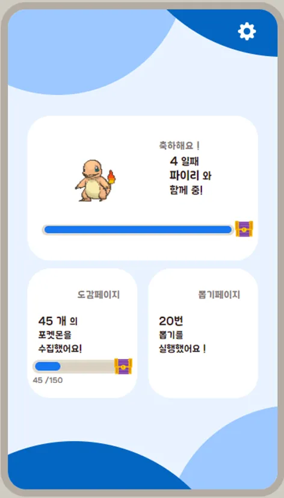

## 🙋‍♂️ about me

- 효율적인 서버 로직과 데이터베이스 설계를 즐기는 개발자예요.
- 사용자와 서비스를 위한 최적의 시스템 설계를 고민해요.
- 새로운 기술을 배우고 적용하는 것을 좋아해요.

## 📞 contact

- email : bssa13942@gmail.com
- portfolio : https://relieved-television-041.notion.site/148ac0f8d35880a284b3f287df3a3077

## 📖 education

- 인공지능사관학교 - 웹기반 인공지능 Track1 (JS) (2024.05 ~ 2024.11)  
- 광주소프트웨어마이스터고등학교 - 임베디드 sw 개발과 (2019.03 ~ 2022.01)

## 🛠 Stack

## 💻 Projects

<table>
<tr>
<td width="60%">

### 1. Wepet (2024.10.15 ~ 2024.11.26) [Repository](https://github.com/chaeliwon/Wepet)
CLIP 기반 맞춤형 유기 동물 입양 매칭 시스템  
[🔗 배포 URL](https://main.d2agnx57wvpluz.amplifyapp.com/)  

**담당 역할**
- Back-End API 개발 및 데이터베이스 설계
- Node.js 기반 서버 아키텍처 설계 및 구현
- RESTful API 설계 및 개발
- 데이터베이스 스키마 설계 및 관리
- Docker 컨테이너화 및 AWS Lambda를 활용한 서버 배포

<table>
  <tr>
    <th width="200">분류</th>
    <th>기술 스택</th>
  </tr>
  <tr>
    <td>Frontend</td>
    <td>
      
    </td>
  </tr>
  <tr>
    <td>Backend</td>
    <td>
      
      
      
    </td>
  </tr>
  <tr>
    <td>Infrastructure & Deployment</td>
    <td>
      
      
      
       
      
      
    </td>
  </tr>
  <tr>
    <td>Database</td>
    <td>
      
      
    </td>
  </tr>
  <tr>
    <td>Development Tools</td>
    <td>
      
      
    </td>
  </tr>
</table>

</td>
<td width="40%" align="center">

</td>
</tr>
</table>

---

<table>
<tr>
<td width="60%">

### 2. PokeTime (2024.07.19 ~ 2024.08.02) [Repository](https://github.com/2024-AISCHOOL-WEB1B/PokeTime)
ViT파인튜닝 이미지 분류기반 포켓몬 키우기 및 루틴 만들기 서비스  

**담당 역할**
- 팀장 및 PM
- 도감 관련 REST API 작성
- 사용자 관련 REST API 작성
- DB 설계 및 구축
- 데이터 전처리 및 수집

<table>
  <tr>
    <th width="200">분류</th>
    <th>기술 스택</th>
  </tr>
  <tr>
    <td>Frontend</td>
    <td>
      
      
    </td>
  </tr>
  <tr>
    <td>Backend</td>
    <td>
      
      
    </td>
  </tr>
  <tr>
    <td>AI/ML</td>
    <td>
      
    </td>
  </tr>
  <tr>
    <td>Database</td>
    <td>
      
    </td>
  </tr>
  <tr>
    <td>Deploy</td>
    <td>
      
      
    </td>
  </tr>
</table>

</td>
<td width="40%" align="center">

</td>
</tr>
</table>
